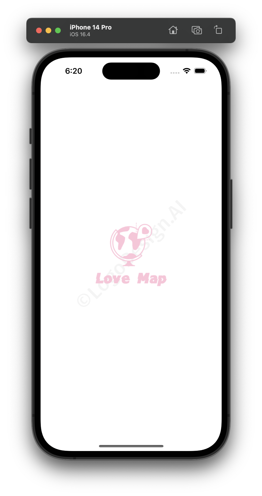
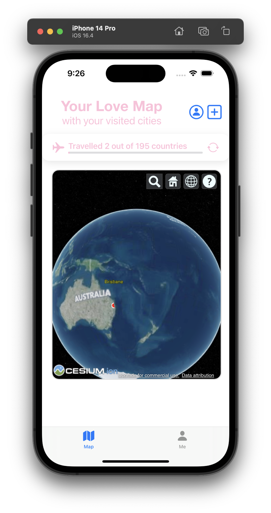
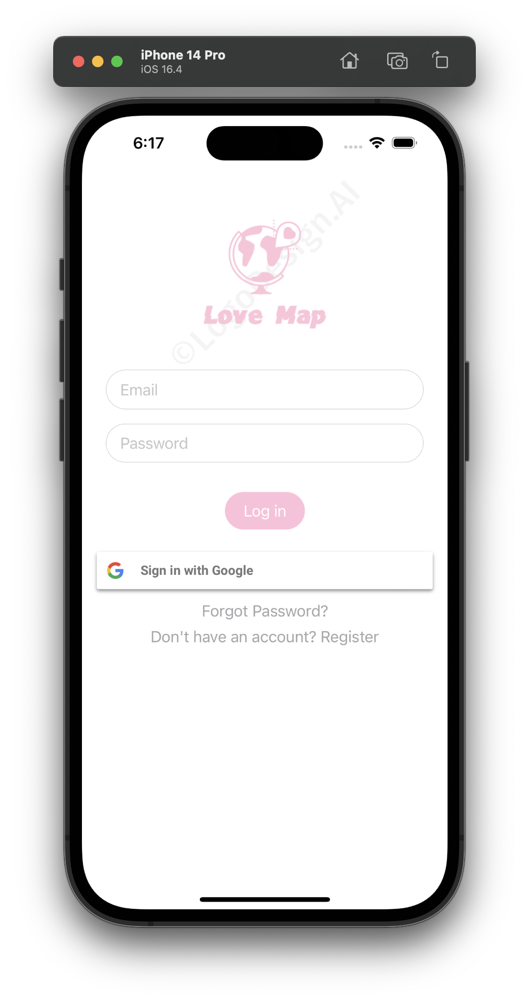
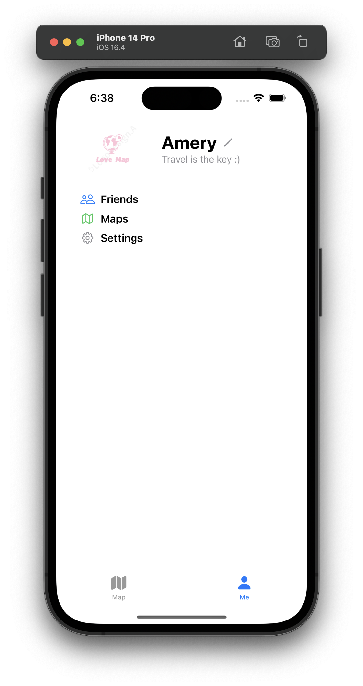
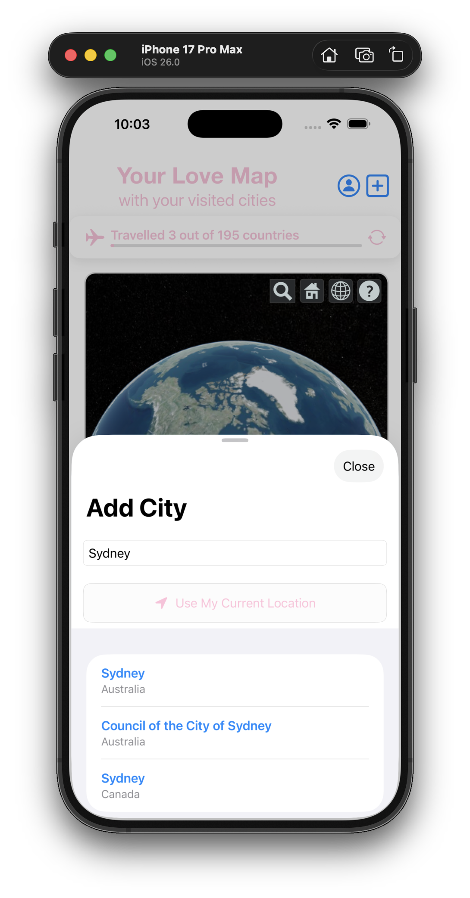
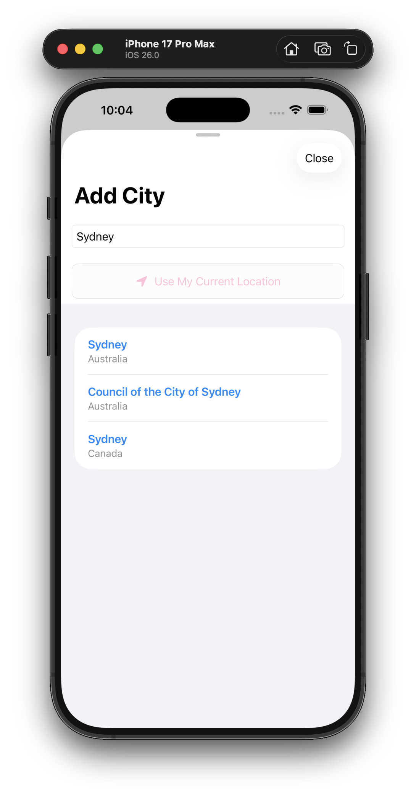

# Love Map ❤️

**Love Map** is a mobile application designed to help users record their travel experiences, visualize the places they’ve visited, and share their adventures with friends or loved ones. It combines personal travel tracking with a social element, making it easy and fun to keep memories alive and foster friendly competition.

---

## Technologies Used 💻

### **Programming Language & Framework**
- **Language**: Swift
- **Framework**: SwiftUI

### **Database**
- **Firebase Realtime Database**: To store user data, location logs, and other app-related information.
- **Firebase Authentication**: To manage user accounts and provide secure login options.

### **APIs & Libraries**
- **Google Maps API**: For map visualization and location search
- **Cesium.js**: For 3D globe visualization and interactive Earth rendering
- **Geoapify API**: For geocoding and location services
- **Core Location**: For GPS location services and current location detection

### **Other Tools**
- **Xcode**: For development and debugging.
---

## Features 🌟
### 1. **Launch Screen**


### 2. **Main Screen - Map View**


   - **Interactive 3D Globe**: Powered by Cesium.js for stunning 3D visualization of Earth
   - **Real-time Location Tracking**: View your current location and visited cities on the globe
   - **City Markers**: Red markers highlight all the cities you've visited with city names
   - **Dynamic Zoom**: Automatic zoom to show all your visited locations or default Earth view
   - **Smooth Navigation**: Intuitive camera controls for exploring the globe
   - **Atmospheric Effects**: Realistic atmosphere rendering for immersive experience
   - **Full Screen Mode**: Built-in full screen button for immersive 3D globe experience

### 3. **Authentication**


   - Secure login with email.
   - Options to log in using Google or Apple accounts.
   
### 4. **User Profiles**


   - Create and customize your profile with a name and avatar.
   - View a summary of all your travel stats.

### 5. **Add City Feature**
<div style="display: flex; gap: 20px; justify-content: center; margin: 20px 0;">
  <div style="text-align: center;">
    
    <p style="font-size: 14px; color: #666; margin-top: 10px;">Half Screen Mode</p>
  </div>
  <div style="text-align: center;">
    
    <p style="font-size: 14px; color: #666; margin-top: 10px;">Full Screen Mode</p>
  </div>
</div>

   - **City Search**: Search for cities worldwide using Geoapify API
   - **Current Location**: Automatically detect and add your current location
   - **Real-time Search**: Live search results as you type city names
   - **One-tap Addition**: Easily add cities to your travel map
   - **Location Services**: Uses Core Location for precise GPS coordinates
   - **Half Screen Mode**: Add city sheet opens in medium size for quick access
   - **Full Screen Mode**: Expandable to full screen for better browsing experience
   - **Drag Indicator**: Visual indicator for easy sheet resizing

### 6. **Interactive Map**
   - A personalized map lights up visited locations.
   - Visualize travel footprints with glowing markers for each destination.

### 7. **Share with Friends**
   - Share your travel map with friends or loved ones.
   - Compete to see who has visited more places.

### 8. **Google Maps Integration**
   - Seamless integration with Google Maps for location searches.
   - Store location details with precise longitude and latitude.

---

## To be Implemented 

The following features are planned for future releases:

- [ ] **Change Profile Picture**: Allow users to update and customize their profile pictures
- [ ] **Add Friend Feature**: Enable users to add friends and share travel experiences 

---

## Installation 

1. **Clone the Repository**:
   ```bash
   git clone https://github.com/zhlu4172/Love-Map.git
   cd Love-Map
